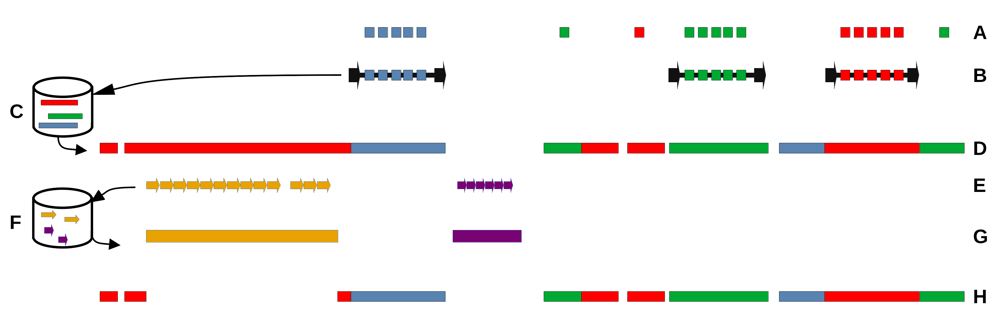

# Genome Annotation with DANTE_LTR and TideCluster on RepeatExplorer Galaxy Server

This protocol describes, step-by-step, how to use DANTE, DANTE_LTR, and TideCluster tools to annotate LTR-retrotransposons and tandem repeats in genome assemblies on the RepeatExplorer Galaxy server ([https://repeatexplorer-elixir.cerit-sc.cz/](https://repeatexplorer-elixir.cerit-sc.cz/) ). DANTE_LTR is specifically developed for annotating LTR-retrotransposons in Viridiplantae genomes, while TideCluster is applicable for annotating tandem repeats in any genome assembly.

*Workflow for annotating LTR-retrotransposons and tandem repeats in genome assemblies using the DANTE, DANTE_LTR, and TideCluster tools on the RepeatExplorer Galaxy server. The colored blocks represent the genomic features annotated at each step. (**A**) Identification of individual LTR-RT protein domains using the DANTE tool.
(**B**) Identification of complete LTR-retrotransposons using the DANTE_LTR tool based on DANTE domain annotations.
(**C**) Creation of a library of representative LTR-retrotransposons from complete elements.
(**D**) Use of the LTR-retrotransposon library to annotate remaining LTR-RTs in the genome assembly using a similarity-based approach. This step also allows for the annotation of incomplete LTR-RTs.
(**E**) Structure-based annotation of tandem repeats using the TideCluster tool.
(**F**) Preparation of a library of tandem repeats from the TideCluster output.
(**G**) Annotation of tandem repeats in the genome assembly using the library-based approach, filling gaps in the tandem repeat annotation provided by TideCluster.
(**H**) Improvement of LTR-RT annotation by subtracting tandem repeat annotations. This step is recommended to prevent misannotation of LTR-RTs due to similarities with tandem repeats.*

## 1. Input Data

Upload your genome assembly in FASTA format to the Galaxy server. The genome assembly file can be either in plain FASTA format or compressed using GZIP.

## 2. Annotation of LTR-Retrotransposons

### 2.1. Annotation of Transposable Elements Protein Domains with DANTE 
- **Tool** : Domain-based Annotation of Transposable Elements (DANTE) 
- **Input Data** :
  - Sequence in FASTA format: uploaded genome assembly 
- **Parameters** :
  - Select REXdb database: Viridiplantae_v3.0
  - Other parameters: default

This tool annotates LTR-RT protein coding domains using a similarity search against the REXdb database. The output includes:
- GFF3 file with the full DANTE output
- Filtered GFF3 file with domains that meet filtering criteria (minimum identity of 35%, minimum similarity of 45%, minimum alignment length of 80% of domain length, and a maximum of three interruptions such as frameshifts or stop codons)
- FASTA file with protein sequences of annotated domains

### 2.2. Annotation of Complete LTR-Retrotransposons with DANTE_LTR 
- **Tool** : DANTE_LTR Retrotransposon Identification 
- **Input Data** :
  - GFF3 output from the DANTE tool: full output
  - Reference sequence matching the DANTE output: genome assembly in FASTA format 
- **Parameters** :
  - Maximum number of missing protein domains tolerated in a full-length retrotransposon: 1

This tool identifies complete LTR-retrotransposons based on the DANTE output. The outputs include:
- GFF3 file with the full DANTE_LTR output
- Statistics of identified LTR-retrotransposons
- Graphical report in HTML format

### 2.3. Creation of a Library of LTR-Retrotransposons for Similarity-Based Annotation 
- **Tool** : Create Representative Library from DANTE_LTR Output 
- **Input Data** :
  - GFF3 output from the DANTE_LTR pipeline
  - Reference sequence matching the DANTE_LTR output: genome assembly in FASTA format

This tool creates a library of representative LTR-retrotransposons based on the DANTE_LTR output. This library is in FASTA format and is suitable for similarity-based annotation using tools like RepeatMasker to annotate incomplete (fragmented, non-autonomous, solo-LTR) LTR-RTs.

### 2.4. Similarity-Based Annotation of LTR-Retrotransposons with RepeatMasker 
- **Tool** : Library-Based Assembly Annotation 
- **Input Data** :
  - Genome assembly to annotate: uploaded genome assembly in FASTA format
  - Library of Repetitive Sequences: library of representative LTR-retrotransposons created in the previous step 
- **Parameters** : use default parameters

This tool annotates LTR-retrotransposons in the genome assembly using RepeatMasker. The resulting annotations are provided in RepeatMasker format (.out) and as a GFF3 file. Overlapping annotations and conflicts are resolved based on classification hierarchy.

## 3. Annotation of Tandem Repeats

### 3.1. Annotation of Tandem Repeats with TideCluster 
- **Tool** : TideCluster 
- **Input Data** :
- Reference fasta: uploaded genome assembly
- Library: optional library in FASTA format 
- **Parameters** : default settings report satellites with monomer lengths between 40-3000 nt. A consensus sequence is calculated for tandem repeats occupying at least 50,000 nt in the assembly.

The output consists of several files:
- GFF3 file with the annotation of tandem repeats
- HTML reports with detailed statistics, consensus, and graphical representation of tandem repeats
- FASTA file with consensus sequences of tandem repeats, which can be used for the similarity-based annotation of tandem repeats in the next step
- Archive with all output files

### 3.2. Annotation of Tandem Repeats in the Genome Assembly Using a Library-Based Approach 
- **Tool** : TideCluster - Annotate Genome 
- **Input Data** :
  - Genome assembly to annotate: uploaded genome assembly in FASTA format
  - Library of tandem repeats: library created in the previous step

This tool re-annotates tandem repeats using a similarity-based approach. It runs RepeatMasker using the tandem repeat library generated by TideCluster. The resulting RepeatMasker output is processed to retain only high-quality tandem repeat hits. Overlapping tandem repeat annotations are merged, and regions shorter than twice the monomer length are excluded from the output. This re-annotation can fill gaps in annotation provided by TideCluster.

## 4. Using Annotated Tandem Repeats to Improve LTR-RT Annotation

### 4.1. Merging Two Tandem Repeat Annotation Tracks 
- **Tool** : Concatenate datasets tail-to-head (cat) 
- **Input Data** :
  - First dataset: TideCluster GFF3 file with tandem repeat annotation
  - Second dataset: GFF3 file with similarity-based tandem repeat annotation

This step creates a combined GFF3 file with tandem repeats annotated by both TideCluster and the library-based approach.

### 4.2. Subtracting Tandem Repeat Annotation from LTR-RT Annotation 
- **Tool** : bedtools subtract 
- **Input Data** :
  - First dataset (-a): GFF3 file with LTR-RT annotation
  - Second dataset (-b): GFF3 file with merged tandem repeat annotation 
- **Parameters** : use default parameters (overlap on either strand) 
- **Output** : GFF3 file with LTR-RT similarity based annotation, excluding regions with tandem repeats

